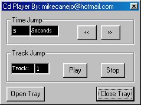



## Make your own CD\-Player\!

### Description

Fixed it! This is the source that will let you make your own CD Player! It uses the Media Control Interface (MCI) via API to play a audio cd. [NOTE: For this class to work on a form you must reference the class eg. (Set Snd = New CDAudio. I already have prepared it in the included zip.)
 
### More Info
 
cd

audio

             |
---                |---
**Submitted On**   |2001-04-19 09:08:36
**By**             |[Michael L\. Canejo](https://github.com/Planet-Source-Code/PSCIndex/blob/master/ByAuthor/michael-l-canejo.md)
**Level**          |Intermediate
**User Rating**    |3.7 (11 globes from 3 users)
**Compatibility**  |VB 4\.0 \(32\-bit\), VB 5\.0, VB 6\.0
**Category**       |[Complete Applications](https://github.com/Planet-Source-Code/PSCIndex/blob/master/ByCategory/complete-applications__1-27.md)
**World**          |[Visual Basic](https://github.com/Planet-Source-Code/PSCIndex/blob/master/ByWorld/visual-basic.md)
**Archive File**   |[Make your 181724102001\.zip](https://github.com/Planet-Source-Code/michael-l-canejo-make-your-own-cd-player__1-1469/archive/master.zip)

